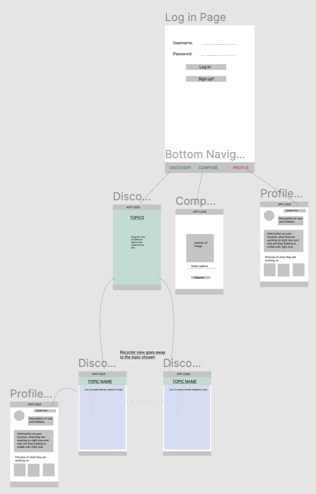
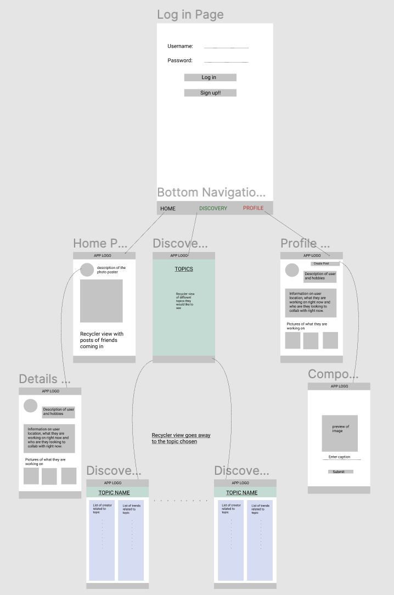

Original App Design Project - README
===

# COLLAB

## Table of Contents
1. [Overview](#Overview)
1. [Product Spec](#Product-Spec)
1. [Wireframes](#Wireframes)
2. [Schema](#Schema)

## Overview
### Description
A social media app to connect creators from different fields to collaborate on new projects

### Demo

### App Evaluation
- **Category:** Photo & Video / Social
- **Mobile:** Uses camera and it is mobile first experience.
- **Story:** Allows users to show their own artwork and collaborate with other artists.
- **Market:** Anyone that is interested in expanding their business and growing their social-media through collaborating and working with other artists could enjoy this app. Gives users the ability to find other users with similar interests.
- **Habit:** Users can post throughout the day many times.
- **Scope:** Users can eventually eventually pay to collobrate with other artists. 

## Product Spec

### 1. User Stories 

- User can create a new profile/Log into existing profile using the Parse Database. 
- User (registered) can create new posts for collab using camera/gallery.
- [Bottom Navigation]: Four fragments with home feed, personal profile, compose picture and discovery feed.
- [Discovery Feed]: Will create a user-specific feed to show them new artists that they are interested in by selecting a list of topics. 
- [Chat Room] Add additional menu items inside the bottom navigation menu to allow users to communicate with each other.
- [Nested RecyclerView] There is an additional recyclerView inside the specific discovery page created so that you can see all the users posts inside the initial feed created instead of being delegated to another page.
- [Pull-to-Refresh] Implement pull to refresh on home timeline.
- [Viewing other users profiles] If a user clicks on a profile, they can view all the posts they have.
- [Home Feed]: Will show friends that you have added in the app and the work they have recently created.
- [Implement PlacePicker on GoogleMap]:Initial sign up consists of an [optional] choice to pick their location. User can see another user's location when viewing their profile using the Google SDK.
- [Find nearby places on GoogleMap]:User can see different hangout spots around their current location to plan a collab with another user. 
- [Comments]: Can add comments on discovery page to start the first contact with other creators. 
- [Follow other users]: User (registered) can follow another user to view on Discovery feed
- [View other profiles]: User can view another user's profile if they click on username in Home Feed
- [ReportBugs Page]: A page meant for users to leave feedback or report any bugs that they are facing.
- [Test on a real Android Device]: Test it on a real device to make sure the app is working.

## 2. Navigation

**Tab Navigation** (Tab to Screen)

* Home Feed
* Profile
* Discovery Page
* Compose Page
* Chat Activity

**Flow Navigation** (Screen to Screen)

* Login Screen
	=> Home

* Discovery Page
	=> List of Topics
	=> Creators you interested in collaborating in the topic chosen

* Compose
	=> launch camera and create new post

* User
	=> Profile Page

* Profile Page
  => Posts
  => Compose Page
  
* Chat Page
  => Facebook Messenger
  => Common Chat Room
  
## Wireframes

### NAVIGATION WITH STRETCH GOALS

## Schema

### Models

#### User

| Property           | Type           | Description                                       |
|:------------------ |:-------------- |:------------------------------------------------- |
| objectId           | String         | unique id for the user (default field)            |
| email              | String         | email user has set for account                    |
| username           | String         | display name of the user                          |
| following          | Array\<String> | list of pointers to users they are following      |
| followers          | Array\<String> | list of pointers to users that are following them |
| createdAt          | DateTime       | date when user is created (default field)         |
| userDescription    | String         | description of the user                           |

#### Post

| Property     | Type            | Description                                             |
| ------------ |:--------------- |:------------------------------------------------------- |
| objectId     | String          | unique id for the project                               |
| name         | String          | display name of the project                             |
| description  | String          | description of the project                              |
| picture      | ParseFile       | image of the work they would like to show               |
| user         | Pointer to User | pointer to User that submitted this project             |
| createdAt    | DateTime        | date when user is created (default field)               |

